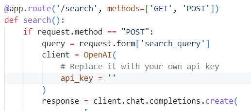
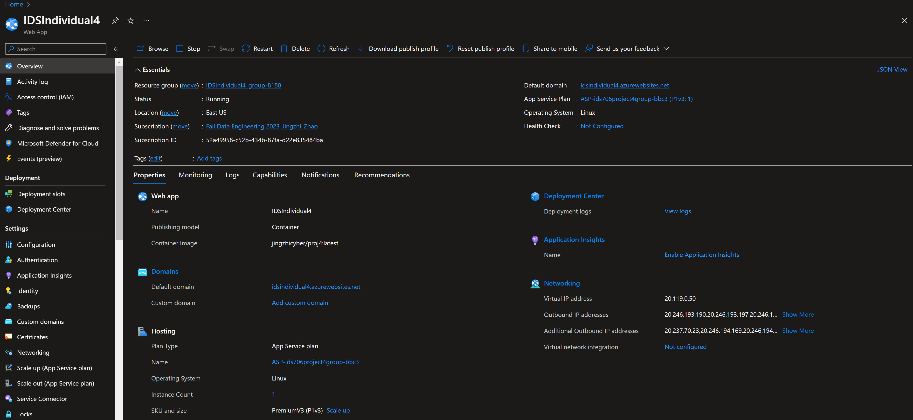
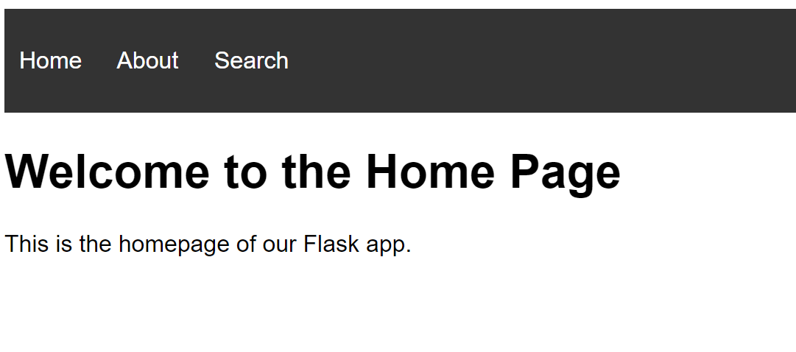
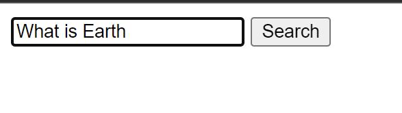
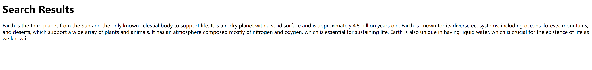

# Project4: Auto-Scaling Flask App on Azure App Services

## Overview
This project demonstrates an auto-scaling Flask application hosted on Azure App Services, featuring integration with OpenAI's Language Learning Models. It showcases the seamless scalability and the power of AI-driven responses in a web application context.

Here is the url to the web app: [Flask_app](https://idsindividual4.azurewebsites.net/)

## Video Demonstration
[Here](https://youtu.be/7qhUYBHQPYM) is a comprehensive walkthrough of the web app, demonstrating its features and functionalities.

## Features
- Flask web application with dynamic content generation using OpenAI's LLM.
- Auto-scaling functionality using Azure App Services.
- Docker containerization for easy deployment and management.

## Dependencies
- Flask
- openai
- Docker
- Azure CLI (for deployment)

## Installation and Setup
1. Clone the repository: git clone https://github.com/nogibjj/jz422-IDS706-Individual-Project4.git

2. Navigate to the project directory: cd jz422-IDS706-Individual-Project4

3. (Optional) Set up a virtual environment and activate it.

4. Install dependencies: pip install -r requirements.txt

5. Set your OpenAI API key

6. Build and run docker file
        
        docker build -t proj4 .
        docker run -p 5000:5000 proj4

7. Login to DockerHub via Codespaces

        docker login --username=
        docker build -t username/repo .
        docker push username/repo

8. Set up via Azure App Services. Make sure to select Docker Container for the Basics and select the Docker container to point to the correct image tab in the DockerHub. After that, go to configuration and add "WEBSITES_PORT" with a value of 5000.

9. After all these steps, you should be able to browse the webapp from the default domain provided on Azure(idsindividual4.azurewebsites.net). Here's an overview of my App:

## Project Structure
- **.devcontainer** includes a Dockerfile and devcontainer.json. The **Dockerfile** within this folder specifies how the container should be built, and other settings in this directory may control development environment configurations.
- **workflows** includes GitHub Actions, which contain configuration files for setting up automated build, test, and deployment pipelines for your project.
- **.gitignore** is used to specify which files or directories should be excluded from version control when using Git.
- **Makefile** is a configuration file used in Unix-based systems for automating tasks and building software. It contains instructions and dependencies for compiling code, running tests, and other development tasks.
- **README.md** is the instruction file for the readers.
- **requirements.txt** is to specify the dependencies (libraries and packages) required to run the project.
- **app.py** is a Python file that contains the main function for the Flask app.
- **static(style.css)** is the cascading style sheet file that contains the style definitions for the web application's user interface.
- **templates** includes HTML template for 'About', 'Home' page of the web application, and 'layout.html' that includes common elements and layout used across the web application, 'search.html' and 'search_results.html' for the page that handles the input and display of the prompts for text generation.